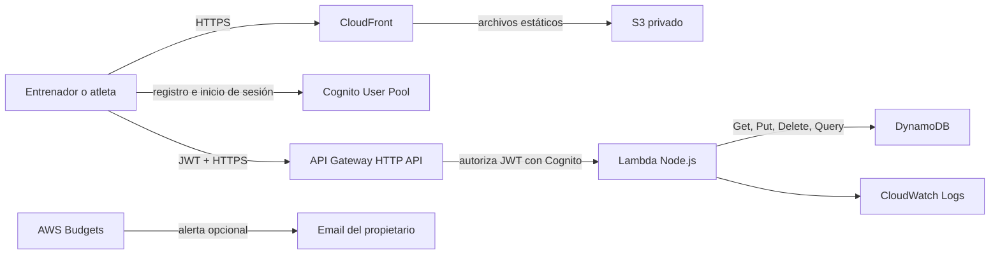

# Arquitectura

## Vista general

PlanUp utiliza una arquitectura completamente serverless en AWS. No hay servidores, contenedores ni bases de datos con capacidad fija que deban mantenerse encendidos.

## Componentes

### PWA web

- Ubicación: `apps/web`.
- React 19, TypeScript y Vite.
- `vite-plugin-pwa` genera el manifiesto y service worker.
- `amazon-cognito-identity-js` administra registro, confirmación e inicio de sesión.
- Phosphor Icons proporciona los íconos funcionales.
- Puede instalarse desde el navegador como aplicación.
- Incluye un modo demo que no requiere AWS.

### Distribución del frontend

- S3 almacena los archivos compilados en un bucket privado.
- CloudFront es el único lector del bucket mediante Origin Access Control.
- CloudFront entrega HTTPS, caché y compresión para `planup.marcos-lucas.uy`.
- ACM emite el certificado TLS en `us-east-1`, requerido por CloudFront.
- Route 53 administra la validación DNS del certificado y los records `A`/`AAAA` alias al dominio CloudFront.
- Los errores 403 y 404 se redirigen a `index.html` para soportar navegación de una SPA.
- El dominio directo de CloudFront del entorno `dev` es `https://d358hs0zx9ij6r.cloudfront.net`.

### Autenticación

- Cognito usa el email como nombre de usuario.
- Verifica el email mediante código.
- El atributo personalizado `custom:role` contiene `coach` o `athlete`.
- El frontend envía el ID token en `Authorization: Bearer <JWT>`.
- API Gateway valida firma, emisor y audiencia antes de invocar Lambda.

### API

- Ubicación: `apps/api`.
- Una única Lambda Node.js 20 ARM64 atiende todos los endpoints.
- API Gateway utiliza HTTP API, más económico que REST API para este alcance.
- La Lambda está configurada con 128 MB y timeout de 10 segundos.
- Los logs se conservan durante siete días para reducir almacenamiento.
- El bundle se produce con esbuild en `apps/api/dist/index.js`.

### Persistencia

- Una tabla DynamoDB en modo `PAY_PER_REQUEST`.
- Claves genéricas `PK` y `SK` permiten guardar varios tipos de entidad.
- Un índice `GSI1` resuelve usuarios por email.
- Point-in-time recovery y cifrado en reposo están habilitados.
- Las consultas de sesiones usan claves compuestas por coach y rangos de fecha; no hacen table scans.

### Infraestructura como código

- Ubicación: `infra`.
- Terraform crea todos los recursos anteriores, permisos IAM mínimos y alertas opcionales de presupuesto.
- La alerta se crea solamente cuando `billing_alert_email` tiene un valor.
- La configuración validada usa AWS Provider 6 y Archive Provider 2.
- La región principal es `sa-east-1`; ACM para CloudFront usa un provider alias en `us-east-1`.

## Decisiones tomadas

| Decisión | Motivo |
|---|---|
| PWA en vez de apps nativas | Un solo código, instalación móvil y menor costo de desarrollo. |
| DynamoDB de tabla única | Patrones de acceso pequeños, costo bajo y escalado automático. |
| Lambda única | Menos infraestructura y despliegue simple para un MVP. |
| HTTP API | Menor costo y complejidad que API Gateway REST. |
| Cognito Lite | Autenticación administrada sin almacenar contraseñas en PlanUp. |
| Texto libre para sesiones | Validar primero el flujo central sin construir un editor complejo. |
| S3 privado con CloudFront | Evitar exposición directa del bucket y mantener HTTPS/caché. |
| Terraform | Infraestructura reproducible, revisable y fácil de destruir o recrear. |

## Seguridad actual

- API Gateway rechaza tokens inválidos antes de llegar a Lambda.
- La Lambda deriva la identidad exclusivamente del JWT, nunca del cuerpo enviado por el cliente.
- Un atleta solo puede leer sesiones cuyo `athleteId` coincide con su `sub` de Cognito.
- El atleta debe tener una relación inversa aceptada para consultar las sesiones de un coach.
- Un entrenador solo puede acceder a atletas vinculados mediante un registro de relación.
- Solo entrenadores pueden crear, editar o eliminar sesiones.
- S3 bloquea todo acceso público.
- IAM permite a Lambda únicamente las operaciones DynamoDB y CloudWatch requeridas.

## Limitaciones de seguridad pendientes

- El rol se elige durante el registro; todavía no existe aprobación administrativa para registrar cuentas de entrenador.
- CORS acepta cualquier origen porque la API exige JWT y todavía no existe un dominio definitivo. Debe restringirse al dominio de producción cuando esté disponible.
- No hay WAF ni rate limiting por usuario; API Gateway tiene un límite general de 25 solicitudes por segundo y burst de 50.
- No hay auditoría funcional de cambios de sesión más allá de `updatedAt` y logs temporales.
