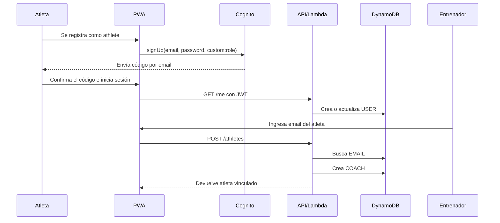
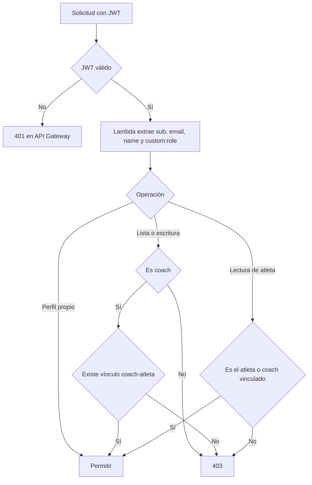

# Funcionamiento del sistema

## Roles

### Entrenador

Puede:

- registrarse y confirmar su email;
- iniciar sesión;
- ver atletas vinculados;
- vincular un atleta registrado mediante su email;
- consultar sesiones del atleta por rango de fechas;
- crear o reemplazar una sesión para una fecha;
- eliminar una sesión.

### Atleta

Puede:

- registrarse y confirmar su email;
- iniciar sesión;
- consultar únicamente sus propias sesiones;
- navegar entre fechas.

El atleta no puede modificar sesiones ni consultar datos de otros atletas.

## Flujo de alta y vinculación

El atleta debe iniciar sesión al menos una vez antes de ser vinculado. `GET /me` crea su perfil consultable por email en DynamoDB.

## Flujo de programación

1. El entrenador selecciona un atleta.
2. La PWA consulta las sesiones del mes visible.
3. El entrenador selecciona una fecha.
4. Si existe una sesión, ve su texto; si no existe, ve el estado vacío.
5. Al editar, escribe texto libre de hasta 20.000 caracteres.
6. `PUT /athletes/{athleteId}/sessions/{date}` guarda o reemplaza la sesión.
7. La UI actualiza su estado local y muestra la confirmación “Sesión guardada”.

El contenido reconoce encabezados `CALENTAMIENTO`, `FUERZA` y `WOD` para presentarlos como bloques visuales. La base de datos conserva el texto completo, por lo que no depende de esa estructura.

## Endpoints

Todos requieren un JWT de Cognito.

| Método | Ruta | Rol | Función |
|---|---|---|---|
| `GET` | `/me` | Ambos | Devuelve identidad y crea/actualiza el perfil DynamoDB. |
| `GET` | `/athletes` | Entrenador | Lista atletas vinculados. |
| `POST` | `/athletes` | Entrenador | Vincula un atleta registrado por email. |
| `GET` | `/athletes/{id}/sessions?from=&to=` | Ambos | Lista sesiones autorizadas en un rango. |
| `PUT` | `/athletes/{id}/sessions/{date}` | Entrenador | Crea o reemplaza la sesión fechada. |
| `DELETE` | `/athletes/{id}/sessions/{date}` | Entrenador | Elimina una sesión. |

## Autorización

## Modo demo

Con `VITE_DEMO_MODE=true`, la PWA evita Cognito y la API. Usa datos definidos en `apps/web/src/demo.ts`. Sirve para diseño, pruebas visuales y desarrollo sin crear recursos AWS.

El modo demo permite:

- ver dos atletas simulados;
- navegar fechas;
- observar sesiones y estados vacíos;
- editar y guardar una sesión en memoria;
- comprobar la adaptación móvil y de escritorio.

Los cambios se pierden al recargar la página.

