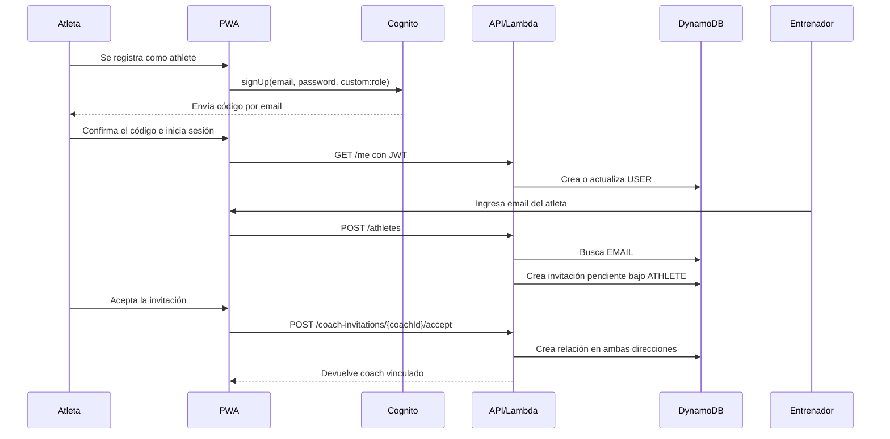
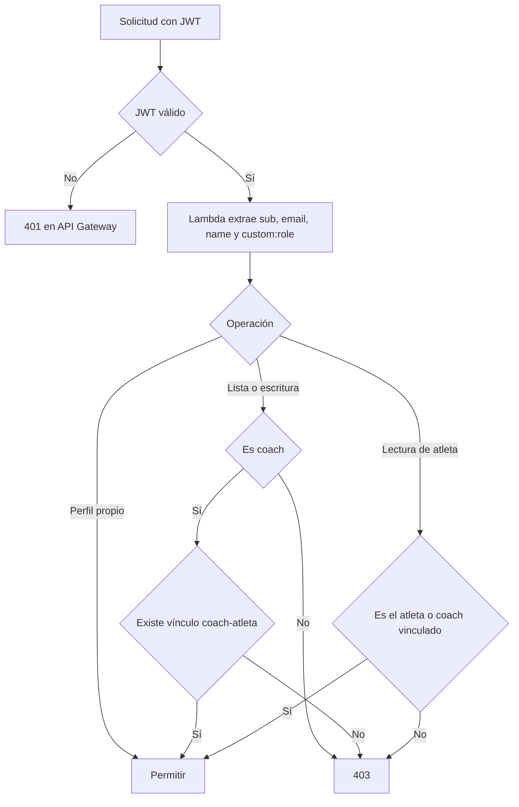

# Funcionamiento del sistema

## Roles

### Entrenador

Puede:

- registrarse y confirmar su email;
- iniciar sesión;
- recuperar su contraseña mediante un código enviado por email;
- ver atletas vinculados;
- invitar un atleta registrado mediante su email;
- consultar todas sus planificaciones guardadas;
- reutilizar una planificación en cualquier fecha y asignarla a uno o más atletas;
- consultar sesiones del atleta por rango de fechas;
- crear o reemplazar una sesión para una fecha;
- eliminar una sesión.

### Atleta

Puede:

- registrarse y confirmar su email;
- iniciar sesión;
- recuperar su contraseña mediante un código enviado por email;
- aceptar o rechazar invitaciones de entrenadores;
- seleccionar uno de sus coaches vinculados;
- consultar únicamente sus propias sesiones para el coach seleccionado;
- navegar entre fechas.

El atleta no puede modificar sesiones ni consultar datos de otros atletas.

## Flujo de alta y vinculación

El atleta debe iniciar sesión al menos una vez antes de poder recibir la invitación. `GET /me` crea su perfil consultable por email en DynamoDB. El entrenador no obtiene acceso hasta que el atleta acepta.

## Recuperación de contraseña

Desde el inicio de sesión, el usuario selecciona **Olvidé mi contraseña**, ingresa su email y recibe un código de Cognito. Luego informa ese código y una contraseña nueva que cumpla la política del User Pool. Cognito valida el código y actualiza la contraseña sin intervención de la API ni de DynamoDB.

La interfaz responde de forma genérica al solicitar el código para no revelar si una dirección está registrada. Durante DEV, Cognito usa temporalmente su servicio de correo predeterminado para poder enviar a direcciones no verificadas. El remitente personalizado de SES se habilitará cuando AWS conceda acceso a producción.

## Flujo de programación

1. La PWA carga las 20 planificaciones más recientes y permite solicitar páginas adicionales con **Cargar más planificaciones**.
2. El listado transporta solamente nombre, fecha y resumen. Cada tarjeta muestra ese resumen al pasar el cursor o enfocarla; al seleccionarla, la PWA solicita el contenido completo y lo abre debajo de la biblioteca.
3. Elige una fecha de destino y uno o más atletas vinculados.
4. La API valida todos los vínculos aceptados y copia la planificación a cada atleta en la fecha elegida.
5. Si ya existe una sesión pendiente, la PWA pide confirmación antes de reemplazarla. Las sesiones iniciadas, completadas u omitidas se conservan y se informan como conflictos.
6. Las sesiones de otros coaches permanecen separadas.

El atleta puede marcar la sesión como iniciada, completada u omitida desde una interfaz adaptada al celular. Al completarla puede agregar opcionalmente hasta cinco resultados simples —peso, repeticiones, tiempo, distancia o nota—, RPE y un comentario. Sólo el atleta puede crear o corregir estos datos.

El contenido reconoce encabezados `CALENTAMIENTO`, `FUERZA` y `WOD` para presentarlos como bloques visuales. La base de datos conserva el texto completo, por lo que no depende de esa estructura.

## Endpoints

Todos requieren un JWT de Cognito.

| Método | Ruta | Rol | Función |
|---|---|---|---|
| `GET` | `/me` | Ambos | Devuelve identidad y crea/actualiza el perfil DynamoDB. |
| `GET` | `/athletes` | Entrenador | Lista atletas vinculados. |
| `POST` | `/athletes` | Entrenador | Crea una invitación para un atleta registrado por email. |
| `GET` | `/coaches` | Atleta | Lista sus coaches aceptados. |
| `GET` | `/coach-invitations` | Atleta | Lista invitaciones pendientes. |
| `POST` | `/coach-invitations/{coachId}/accept` | Atleta | Acepta una invitación y crea el vínculo. |
| `POST` | `/coach-invitations/{coachId}/reject` | Atleta | Rechaza una invitación. |
| `GET` | `/coach-sessions?limit=&cursor=` | Entrenador | Lista resúmenes paginados; devuelve un cursor opaco cuando hay otra página. |
| `GET` | `/coach-sessions/{date}/{id}` | Entrenador | Obtiene el contenido completo de una planificación. |
| `POST` | `/coach-sessions` | Entrenador | Crea una planificación reutilizable. |
| `POST` | `/coach-sessions/{date}/{id}/assign` | Entrenador | Asigna una planificación a varios atletas. |
| `GET` | `/athletes/{id}/sessions?coachId=&from=&to=` | Ambos | Lista sesiones del coach indicado en un rango. |
| `PUT` | `/me/sessions/{coachId}/{date}/execution` | Atleta | Actualiza estado, resultados, RPE y comentario con versión e idempotencia. |

## Autorización

## Modo demo

Con `VITE_DEMO_MODE=true`, la PWA evita Cognito y la API. Usa datos definidos en `apps/web/src/demo.ts`. Sirve para diseño, pruebas visuales y desarrollo sin crear recursos AWS.

El modo demo permite:

- ver dos atletas simulados;
- navegar fechas;
- observar sesiones y estados vacíos;
- editar y guardar una sesión en memoria;
- comprobar la adaptación móvil y de escritorio.

Los cambios se pierden al recargar la página.
